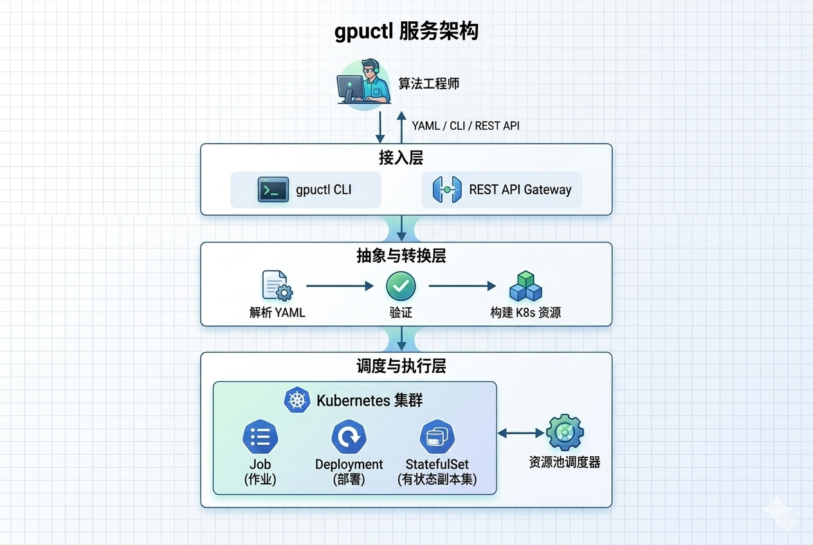

<!-- Banner 区域 -->
<p align="center">
  
</p>

<!-- 彩色徽章 Shields -->
<p align="center">
  <a href="https://github.com/g8s-host/gpuctl/releases">
    
  </a>
  
  
  
  
</p>

<!-- 一句话标语 -->
<h2 align="center">🚀 像写 Python 脚本一样调度 GPU 集群</h2>

<p align="center">
  <b>声明式 YAML</b> · <b>零 K8s 知识</b> · <b>资源池隔离</b>
</p>

<p align="center">
  <a href="./doc/README.zh-CN.md">简体中文</a> •
  <a href="#-quick-start">快速开始</a> •
  <a href="#-documentation">文档</a> •
  <a href="#-features">特性</a>
</p>

---

## ✨ 为什么选择 gpuctl

<!-- 第1行：核心价值 -->
<table align="center">
  <tr>
    <td align="center" width="25%">
      <br><br>
      <b>一行命令搞定</b><br>
      <code>gpuctl create -f job.yaml</code><br><br>
      <sub>告别 100+ 行 K8s YAML，用声明式配置提交任务</sub>
    </td>
    <td align="center" width="25%">
      <br><br>
      <b>多团队资源隔离</b><br>
      训练池 / 推理池 / 开发池<br><br>
      <sub>逻辑隔离避免争抢，支持按团队配额管理</sub>
    </td>
    <td align="center" width="25%">
      <br><br>
      <b>AI 框架开箱即用</b><br>
      DeepSpeed / VLLM / LlamaFactory<br><br>
      <sub>自动注入 NCCL 环境变量和分布式配置</sub>
    </td>
    <td align="center" width="25%">
      <br><br>
      <b>一站式监控</b><br>
      日志 / 事件 / 资源用量<br><br>
      <sub>告别 kubectl get pods 找 Pod 名的繁琐</sub>
    </td>
  </tr>
</table>

<!-- 第2行：更多优势 -->
<table align="center">
  <tr>
    <td align="center" width="25%">
      <br><br>
      <b>算法工程师友好</b><br>
      kind / job / resources<br><br>
      <sub>熟悉的 YAML 语法，无需理解 Pod/Deployment</sub>
    </td>
    <td align="center" width="25%">
      <br><br>
      <b>Namespace 级配额</b><br>
      CPU / Memory / GPU<br><br>
      <sub>创建 Namespace 自动绑定 ResourceQuota</sub>
    </td>
    <td align="center" width="25%">
      <br><br>
      <b>完整 API 支持</b><br>
      HTTP / WebSocket<br><br>
      <sub>易于集成到 MLOps 平台或自建系统</sub>
    </td>
    <td align="center" width="25%">
      <br><br>
      <b>已有 K8s 集群</b><br>
      直接可用<br><br>
      <sub>不修改集群配置，不影响现有工作负载</sub>
    </td>
  </tr>
</table>

---

## 🚀 Quick Start

```bash
# 1. 安装 CLI
pip install gpuctl

# 2. 提交 LLM 微调任务（4x A100）
cat > training.yaml << 'EOF'
kind: training
version: v0.1
job:
  name: qwen2-7b-sft
environment:
  image: llama-factory:latest
  command: ["llamafactory-cli", "train", "--stage", "sft"]
resources:
  pool: training-pool
  gpu: 4
  cpu: 32
  memory: 128Gi
EOF

gpuctl create -f training.yaml

# 3. 查看任务状态
gpuctl get jobs

# 4. 实时查看日志
gpuctl logs qwen2-7b-sft -f
```

<!-- Demo GIF 占位符 - 后续替换为实际动图 -->
<p align="center">
  
  <br>
  <sub>👆 终端操作演示（后续替换为实际录制）</sub>
</p>

---

## 🆚 gpuctl vs 原生 Kubectl

<table width="100%">
  <tr>
    <th width="25%">场景</th>
    <th width="37.5%">✨ gpuctl 方式</th>
    <th width="37.5%">原生 Kubectl 方式</th>
  </tr>
  <tr>
    <td><b>📝 提交训练任务</b></td>
    <td><b>只需 15-20 行声明式配置</b>，填写 kind、job.name、resources.gpu 等算法工程师熟悉的字段即可提交任务</td>
    <td>编写 120+ 行 K8s YAML，手动创建 Secret、ConfigMap、Job 等资源，需要理解 PodSpec、ResourceRequirements、VolumeMounts 等复杂概念</td>
  </tr>
  <tr>
    <td><b>📊 查看任务状态</b></td>
    <td><b>一条命令查看所有任务</b> <code>gpuctl get jobs</code>，自动聚合 Pod 状态，直接显示任务名称、状态、资源用量</td>
    <td>先 <code>kubectl get jobs</code> 找到 Job，再 <code>get pods -l job-name=xxx</code> 找到 Pod，最后 <code>describe pod</code> 查看详情，流程繁琐</td>
  </tr>
  <tr>
    <td><b>🔍 查看任务日志</b></td>
    <td><b>直接用任务名查看日志</b> <code>gpuctl logs &lt;job-name&gt; -f</code>，自动追踪 Pod 变化，支持多副本聚合日志</td>
    <td>需要记住 Pod 名称（如 <code>training-job-7d9f4b8c5-x2mnp</code>），执行 <code>kubectl logs &lt;pod-name&gt; -f</code>，Pod 重启后名称变化需要重新查找</td>
  </tr>
  <tr>
    <td><b>🧠 多 GPU 训练</b></td>
    <td><b>声明 gpu 数量即可</b>，平台自动注入 NCCL_SOCKET_IFNAME、MASTER_ADDR、WORLD_SIZE 等环境变量，自动配置 DeepSpeed</td>
    <td>手动配置 NCCL 环境变量、DeepSpeed hostfile、PyTorch 启动参数，需要理解 GPU 通信和进程组概念</td>
  </tr>
  <tr>
    <td><b>🏊 资源池管理</b></td>
    <td><b>声明式资源池配置</b>，<code>pool: training-pool</code> 自动调度到对应节点组，支持多团队资源隔离和配额管控</td>
    <td>通过 LabelSelector 和 NodeAffinity 手动绑定节点，需要为每个团队维护复杂的调度策略和资源限制</td>
  </tr>
  <tr>
    <td><b>📋 资源配额管理</b></td>
    <td><b>配额随 Namespace 自动创建</b>，<code>gpuctl describe quota</code> 一键查看已用/总量，超限自动拦截并给出友好提示</td>
    <td>手动创建 ResourceQuota 和 LimitRange，每个 Namespace 需要单独配置，配额使用情况需要多次查询汇总</td>
  </tr>
  <tr>
    <td><b>⚡ 部署推理服务</b></td>
    <td><b>自动创建 Deployment + Service</b>，声明 replicas 和 port 即可，自动生成 NodePort 暴露服务，内置就绪探针</td>
    <td>分别创建 Deployment、Service、Ingress/NodePort，配置 HPA 自动扩缩容，需要理解 Service 类型和网络策略</td>
  </tr>
  <tr>
    <td><b>📓 启动 Notebook</b></td>
    <td><b>一键启动 JupyterLab</b>，自动生成访问链接，支持自定义镜像和密码，自动挂载存储卷</td>
    <td>手动创建 StatefulSet、Headless Service、Ingress，配置 PVC 存储，处理 Jupyter Token 和密码</td>
  </tr>
</table>

---

## 🏗️ Architecture

<p align="center">
  
</p>

```
┌─────────────┐     ┌─────────────┐     ┌─────────────────────────────┐
│   User      │────▶│  gpuctl CLI │────▶│  K8s Job/Deployment/        │
│  (YAML)     │     │   / REST API│     │  StatefulSet + Service      │
└─────────────┘     └─────────────┘     └─────────────────────────────┘
```

---

## 📚 Documentation

完整文档请访问 **[docs/](docs/)** 目录，或查看以下快速导航：

### 🚀 入门
从零开始使用 gpuctl，快速体验声明式 GPU 调度带来的效率提升

- **[快速开始](docs/user-guide/quickstart.md)** — 5 分钟完成首个训练任务提交，从安装到查看日志的完整流程，包含 ready-to-use 的示例 YAML 文件
- **[安装指南](docs/install.md)** — 详细说明 PyPI 安装、源码安装、二进制下载三种方式，以及 K8s 集群连接配置和权限设置

### 📖 用户指南
深入了解 gpuctl 的四大任务类型，掌握生产环境下的最佳实践

- **[训练任务](docs/user-guide/training.md)** — 详解 LlamaFactory + DeepSpeed 分布式训练配置，涵盖单机多卡、Checkpoint 保存、自定义镜像等高级用法，以及训练过程中的监控和故障恢复
- **[推理服务](docs/user-guide/inference.md)** — VLLM 推理服务的完整部署流程，包括自动扩缩容配置、服务暴露、多副本负载均衡，以及生产环境的性能调优建议
- **[Notebook](docs/user-guide/notebook.md)** — JupyterLab 交互式开发环境的创建与管理，支持自定义镜像、持久化存储、GPU 共享等场景，适合模型调试和数据探索
- **[资源池管理](docs/user-guide/pool.md)** — 将集群 GPU 节点划分为逻辑资源池，实现训练/推理/开发环境的资源隔离，避免多团队之间的资源争抢

### 🔧 参考文档
速查手册和 API 说明，解决使用过程中的具体问题

- **[CLI 命令](docs/cli/index.md)** — gpuctl 全部命令的完整参考，包括 create、get、logs、delete 等常用命令的参数说明和典型使用示例
- **[API 文档](docs/developer-guide/api.md)** — RESTful API 的详细接口定义，包含请求/响应格式、错误码说明，以及 Python/JavaScript 调用示例
- **[常见问题](docs/faq.md)** — 汇总用户最常遇到的 20+ 个问题，如 Pod 调度失败、镜像拉取错误、GPU 不可见等，提供详细的排查步骤和解决方案

### 🛠️ 开发贡献
了解 gpuctl 的内部实现，参与社区贡献，共同打造更好的 AI 算力调度平台

- **[架构设计](docs/developer-guide/architecture.md)** — 深入解析 gpuctl 的分层架构设计，包括 YAML 解析器、Builder 模式、K8s Client 封装等核心模块的实现原理
- **[本地开发](docs/developer-guide/index.md)** — 搭建本地开发环境，运行单元测试和集成测试，调试代码并提交 PR 的完整工作流
- **[贡献指南](CONTRIBUTING.md)** — 代码规范、Commit Message 格式、Issue 和 PR 的提交规范，以及社区行为准则

---

## 💻 Installation

### Prerequisites
- Python 3.8+
- Kubernetes cluster access (via `kubectl`)

### From PyPI (推荐)
```bash
pip install gpuctl
```

### From Source
```bash
git clone https://github.com/g8s-host/gpuctl.git
cd gpuctl
pip install -e .
```

### Binary Download
```bash
# Linux
wget https://github.com/g8s-host/gpuctl/releases/latest/download/gpuctl-linux-amd64
chmod +x gpuctl-linux-amd64
sudo mv gpuctl-linux-amd64 /usr/local/bin/gpuctl
```

---

## 🌟 Show Your Support

如果 gpuctl 对你有帮助，请给我们一个 ⭐️ Star！

<a href="https://github.com/g8s-host/gpuctl/stargazers">
  
</a>

---

## 📄 License

[MIT License](LICENSE) © 2024 GPU Control Team
