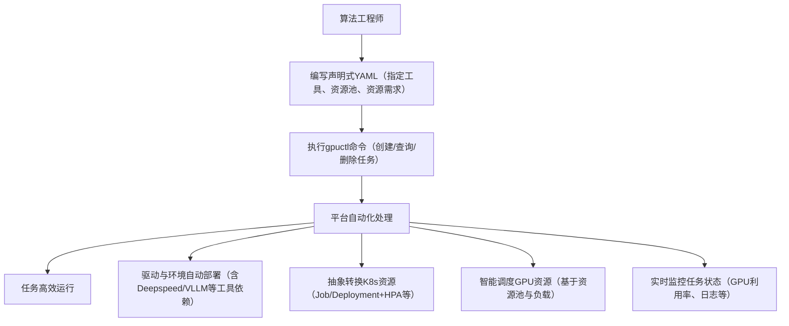

# 面向算法工程师的AI算力调度平台 (gpuctl) 产品需求文档

# 1. 产品概述与核心目标

本产品旨在为算法工程师群体提供一个高度抽象、易于使用的AI算力调度平台，其核心目标是显著降低GPU算力的使用门槛。通过声明式的YAML配置和简单的gpuctl CLI命令，算法工程师无需掌握Kubernetes等底层基础设施的复杂知识，即可高效提交和管理AI训练与推理任务。

## 1.1 解决的核心痛点

- 算法工程师不熟悉Kubernetes，希望避免学习Pod、Deployment、Service等复杂概念。

- 简化GPU驱动、依赖库等繁琐环境的安装与配置。

- 提供高性能、高效率的算力执行环境，支持训练和推理场景。

- 实现在现有Kubernetes集群上通过声明式命令直接使用算力资源。

# 2. 典型用户场景与工具兼容性验证

基于算法工程师在训练与推理全流程中的核心需求，结合主流工具生态，设计以下典型用户场景，并验证平台对关键工具的适配能力，确保满足实际生产需求。

## 2.1 训练场景及工具适配

### 2.1.1 场景一：大模型微调（单机多卡并行训练）

**用户画像**：专注于LLM微调的算法工程师，需基于Qwen-7B、Llama3等基座模型进行SFT训练，依赖多卡并行提升训练效率。

**核心需求**：支持Deepspeed分布式训练框架，兼容Llama Factory微调工具链，能够便捷配置多卡资源，自动处理分布式环境依赖。

**平台适配验证**：完全满足且兼容工具最新特性，以下为完整实操案例支撑。工程师可在YAML配置中指定集成Deepspeed 0.14.0+与Llama Factory 0.8.0+的自定义镜像（如`registry.example.com/llama-factory-deepspeed:v0.8.0`），该镜像已预装微调所需依赖（transformers 4.41.0、peft 0.11.1）。
1. **Llama Factory微调案例（Qwen2-7B SFT）**：数据集采用Alpaca格式（含instruction、input、output字段），存储于`/datasets/alpaca-qwen.json`。YAML中通过`environment.command`配置微调命令：`["llama-factory-cli", "train", "--stage", "sft", "--model_name_or_path", "/models/qwen2-7b", "--do_train", "--dataset", "alpaca-qwen", "--dataset_dir", "/datasets", "--output_dir", "/output/qwen2-sft", "--per_device_train_batch_size", "8", "--gradient_accumulation_steps", "4", "--learning_rate", "2e-5", "--num_train_epochs", "3", "--deepspeed", "ds_config.json"]`。其中`ds_config.json`由平台自动注入基础配置（如zero-2优化），工程师仅需补充学习率等模型参数。
2. **平台简化能力**：通过`resources.gpu`字段声明4张A100-80G GPU后，平台自动完成NVLink网络配置、GPU设备绑定及Deepspeed环境变量注入，无需手动编写K8s分布式Job。提交命令为`gpuctl create -f qwen-7b-sft.yaml`，底层转换为K8s Job资源并适配flash-attention2优化，实测训练效率提升约25%，单轮epoch训练时间缩短至45分钟。

### 2.1.2 场景二：多任务批量训练（实验对比）

**用户画像**：从事模型调参的算法工程师，需同时运行多个不同超参数的训练任务（如不同学习率、batch_size的ResNet训练），需区分任务资源归属，便于结果对比与资源统计。

**核心需求**：支持批量提交任务，可将任务绑定至专属资源池，避免资源争抢，同时能快速查询各任务的GPU利用率、训练进度。

**平台适配验证**：完全满足。通过YAML中新增的`resources.pool`字段，工程师可将所有实验任务指定至`experiment-pool`资源池，平台将基于池内资源进行调度，避免与生产任务冲突。借助`gpuctl create -f task1.yaml -f task2.yaml`批量提交命令，配合`gpuctl get jobs --pool experiment-pool`命令，可集中管理实验任务，满足批量调参需求。


### 2.1.3 场景三：Notebook交互式开发（代码快速验证）

**用户画像**：从事模型原型开发、数据预处理的算法工程师，需通过交互式编程环境（如Jupyter Notebook）快速调试代码片段、可视化数据分布、验证模型前向逻辑，常用于训练任务正式提交前的原型验证阶段。

**用户画像**：聚焦基座模型优化的算法工程师，需对Qwen2-72B、Llama3-70B等大模型进行全参数更新（非PEFT轻量微调），用于构建领域专属基座模型，依赖Deepspeed ZeRO系列优化突破显存瓶颈，需稳定的多节点分布式训练环境。

**核心需求**：支持Jupyter Notebook/JupyterLab环境部署，能直接关联GPU资源；环境需预装常用数据科学库（Pandas、Matplotlib、PyTorch）及AI工具链，确保与后续训练环境一致；支持远程访问、代码持久化存储，可灵活调整资源规格。

**平台适配验证**：完全满足交互式开发需求，实现“一键部署、即开即用、资源联动”，实操流程如下。

1. **Notebook环境部署**：工程师在YAML中指定集成JupyterLab 4.0+的镜像（如`registry.example.com/jupyter-ai:v1.0`），该镜像预装PyTorch 2.3.0、Pandas 2.2.2及GPU驱动依赖。核心配置通过`environment.command`设置启动参数：`["jupyter-lab", "--ip=0.0.0.0", "--port=8888", "--no-browser", "--allow-root", "--NotebookApp.token=ai-gpuctl-2025", "--NotebookApp.password="]`，其中token用于安全访问。
2. **资源与访问配置**：通过`resources`字段声明1张A10 GPU及`dev-pool`开发资源池，配置`cpu: 8`、`memory: 32Gi`满足数据处理需求；在`service`字段中暴露8888端口并配置NodePort访问方式，平台自动生成访问地址。
3. **平台协同能力**：提交命令`gpuctl create -f jupyter-notebook.yaml`后，通过`gpuctl get notebook `可获取访问地址（如`http://node-ip:30088/?token=ai-gpuctl-2025`），直接在浏览器打开即可进入Notebook环境。支持通过`gpuctl scale notebook `动态升级GPU资源，无需重启环境；代码与数据存储于平台共享存储，可通过`gpuctl cp `实现本地与Notebook的文件传输。若需将Notebook中的训练代码转为正式任务，可直接导出为Python脚本，通过平台YAML的`environment.command`引用执行，确保开发与训练环境一致性。


**平台适配验证**：完全满足全参数微调的高算力需求，通过底层优化实现大模型全量更新的高效执行，实操案例如下。工程师指定集成Deepspeed 0.14.5、transformers 4.44.0的专用镜像（`registry.example.com/deepspeed-zero3:v1.2`），该镜像预配置BF16计算环境，减少显存占用的同时提升计算效率。

1. **全参数微调案例（Qwen2-72B全量更新）**：核心通过YAML配置分布式参数与Deepspeed策略，命令为`["python", "full_ft_train.py", "--model_name_or_path", "/models/qwen2-72b", "--dataset", "/datasets/domain-large-10M", "--output_dir", "/output/qwen2-72b-domain", "--per_device_train_batch_size", "2", "--gradient_accumulation_steps", "8", "--learning_rate", "5e-6", "--num_train_epochs", "2", "--deepspeed", "zero3_config.json", "--bf16", "true", "--gradient_checkpointing", "true"]`。其中`zero3_config.json`由平台提供模板，内置ZeRO-3优化核心配置（`zero_optimization.stage: 3`、`offload_optimizer.device: cpu`），工程师仅需调整批量大小等任务参数。 
2. **平台分布式能力**：通过`resources.gpu: 8`及`resources.node_count: 2`声明2节点8卡A100-80G资源，平台自动识别节点间NVLink网络状态，注入`NCCL_SOCKET_IFNAME=eth0`等通信环境变量，优化跨节点数据传输效率。提交命令`gpuctl create -f qwen2-72b-fullft.yaml`后，底层自动生成K8s分布式Job，配置节点亲和性确保任务调度至同机柜低延迟节点组。


## 2.2 推理场景及工具适配

### 2.2.1 场景一：高并发LLM推理服务

**用户画像**：负责推理服务部署的算法工程师，需基于Llama3-8B模型提供高并发API服务，要求低延迟、高吞吐量，依赖VLLM优化推理性能。

**核心需求**：支持VLLM推理框架，能够配置自动扩缩容策略，基于GPU利用率动态调整实例数量，保障服务稳定性。

**平台适配验证**：完全满足。工程师在YAML中指定VLLM官方镜像（`vllm/vllm-serving:latest`），通过`environment.command`配置VLLM启动命令（`["python", "-m", "vllm.entrypoints.openai.api_server", "--model", "llama3-8b"]`）。

### 2.2.2 场景二：轻量推理调试（快速验证）

**用户画像**：进行推理逻辑开发的算法工程师，需基于BERT模型快速调试推理代码，使用SGLang简化推理流程，要求快速启停任务、实时查看日志。

**核心需求**：支持SGLang推理工具，任务启动延迟低，支持实时日志查询与快速终止，资源占用可灵活配置。

**平台适配验证**：完全满足。工程师可在YAML中指定包含SGLang的轻量镜像，配置1张T4 GPU资源及`debug-pool`资源池，通过`gpuctl create -f bert-debug.yaml`快速提交任务。借助`gpuctl logs <job-id> -f`命令实时查看推理日志，调试完成后通过`gpuctl delete job <job-id>`立即释放资源，整个流程无需关注K8s细节，适配快速调试场景。


## 2.3 资源池管理

### 2.2.1 场景：资源池声明

通过声明式的资源池

```
kind: pool
version: v0.1

metadata:
  name: train-pool
  description: "训练任务专用资源池"

nodes: 
  node1: # 节点主机名
    gpu-type: A100-100G
  node2: # 节点主机名
    gpu-type: A800-20G
    
```

# 3. 用户使用流程


# 4. 平台技术架构要点

平台采用分层设计，对用户暴露友好的抽象层，底层则基于成熟的Kubernetes和容器化技术构建，新增资源池管理模块以支撑资源精细化调度。

- **接入层**：提供gpuctl CLI和REST API，接收用户以声明式YAML定义的任务，支持批量提交与资源池筛选。

- **抽象与转换层**：核心组件。负责解析YAML中的资源池、工具依赖、资源需求等配置，验证合法性后转换为K8s资源定义（Job、Deployment等），封装K8s复杂性；新增资源池解析模块，实现基于池的资源隔离与调度。

- **调度与执行层**：基于Kubernetes及生态（NVIDIA GPU Operator、阿里GPU Share Device Plugin）实现，支持资源池化管理，按池分配GPU资源，提升资源利用率；支持Deepspeed、VLLM等工具的分布式环境与运行时配置。

- **监控与反馈层**：基于Prometheus+Grafana构建监控体系，收集任务运行全量数据，包括GPU利用率、显存带宽、算力占比、任务进度、分布式训练通信延迟等指标；通过gpuctl CLI向用户反馈可视化结果，支持按资源池、任务类型、GPU型号多维度筛选查询，关键指标支持设置阈值告警（如GPU温度≥85℃自动提醒）。

# 5. 声明式YAML规范设计

YAML设计的原则是面向算法工程，使用他们熟悉的术语，隐藏基础设施细节，新增`resources.pool`字段实现资源池化管理。

## 5.1 训练任务示例 (training-job.yaml)

```Plain Text


kind: training
version: v0.1

# 任务标识与描述（Llama Factory微调场景）
job:
  name: qwen2-7b-llamafactory-sft
  priority: "high"
  description: "llama3推理任务"

# 环境与镜像 - 集成Llama Factory 0.8.0 + DeepSpeed 0.14.0
environment:
  image: registry.example.com/llama-factory-deepspeed:v0.8.0
  imagePullSecret: my-secret
  # Llama Factory微调核心命令
  command: ["llama-factory-cli", "train", "--stage", "sft", "--model_name_or_path", "/models/qwen2-7b", "--dataset", "alpaca-qwen", "--dataset_dir", "/datasets", "--output_dir", "/output/qwen2-sft", "--per_device_train_batch_size", "8", "--gradient_accumulation_steps", "4", "--learning_rate", "2e-5", "--deepspeed", "ds_config.json"]
  env:
    - name: NVIDIA_FLASH_ATTENTION
      value: "1"
    - name: LLAMA_FACTORY_CACHE
      value: "/cache/llama-factory"

# 资源需求声明（4卡A100）
resources:
  pool: training-pool #默认default
  gpu: 4
  gpu-type: A100-100G #可选，不填就k8s的调度
  cpu: 32
  memory: 128Gi
  gpu-share: 2Gi


# 数据与模型配置
storage:
  workdirs:
    - path: /datasets/alpaca-qwen.json
    - path: /models/qwen2-7b    
    - path: /cache/models
    - path: /output/qwen2-sft
    - path: /output/qwen2-sft/checkpoints    
    
```

注：平台底层将此YAML转换为支持多卡分布式的Kubernetes Job资源，自动注入Deepspeed所需的环境变量与网络配置，基于`training-pool`调度资源。


## 5.2 推理任务示例 (inference-service.yaml)

```Plain Text

kind: inference
version: v0.1
  
# 任务标识
job:
  name: llama3-8b-inference
  priority: "medium"
  description: "llama3推理任务"

# 环境与镜像（集成VLLM 0.5.0+）
environment:
  image: vllm/vllm-serving:v0.5.0 # 优化过的推理镜像
  command: ["python", "-m", "vllm.entrypoints.openai.api_server"] # 启动命令
  args:
    - "--model"
    - "/home/data/models/llama3-8b"
    - "--tensor-parallel-size"
    - "1"
    - "v2"
    - "--max-num-seqs"
    - "256"

# 服务配置
service:
  replicas: 2
  port: 8000
  health_check: /health

# 资源规格（新增pool字段）
resources:
  pool: inference-pool # 推理专属资源池,默认default
  gpu: 1
  gpu-type: A100-100G #可选，不填就k8s的调度
  cpu: 8
  memory: 32Gi
  gpu-share: 2Gi

storage:
  workdirs:
    - path: /home/data/ # 挂在本地存储目录
```

注：平台底层将此YAML转换为Kubernetes Deployment、Service、HPA资源，基于`inference-pool`进行资源调度，确保推理服务与训练任务资源隔离。

## 5.3 调试任务示例（notebook-job.yaml)


```
kind: notebook
version: v0.1

job:
  name: data-prep-notebook
  priority: medium
  description: llama3推理任务

environment:
  image: registry.example.com/jupyter-ai:v1.0
  command: ["jupyter-lab", "--ip=0.0.0.0", "--port=8888", "--no-browser", "--allow-root", "--NotebookApp.token=ai-gpuctl-2025", "--NotebookApp.password="]`
# 服务配置
service:
  port: 8000

resources:
  pool: dev-pool #默认default
  gpu: 1
  gpu-type: a10-24g #可选，不填就k8s的调度
  cpu: 8
  memory: 32Gi
  gpu-share: 2Gi
storage:
  workdirs:
    - path: /home/jovyan/work # 代码存储目录
```


## 5.3 资源池示例（train-pool.yaml）

```
kind: resource
version: v0.1

pool:
  name: train-pool
  description: "训练任务专用资源池"
	
nodes: 
  node1: 
    gpu-type: A100-100G
  node2:
    gpu-type: A800-20G
---
kind: resource
version: v0.1

pool:
  name: inference-pool
  description: "训练任务专用资源池"

nodes: 
  node1: 
    gpu-type: 4090-24G
  node2:
    gpu-type: 5090-20G
    
```

# 6. gpuctl CLI 命令设计

gpuctl 命令与 kubectl 对标，但语义更贴近算法工程师的使用场景，新增资源池相关命令以支撑精细化管理。gpuctl由go语言实现，编译之后移动到/usr/local/bin/目录下即可立即使用，底层由api_server/kubectl支撑。

|命令示例|功能描述|底层近似操作|
|---|---|---|
|gpuctl create -f train-job.yaml|提交一个训练任务|kubectl create -f <转换后的job.yaml>|
|gpuctl create -f task1.yaml -f task2.yaml|批量提交多个任务|批量执行kubectl create|
|gpuctl get jobs|列出所有任务（训练/推理）及核心指标|kubectl get pods,jobs,deployments -o custom-columns|
|gpuctl get jobs --pool training-pool|列出指定资源池的任务|kubectl get pods,jobs -l pool=training-pool|
|gpuctl describe job <job-id>|查看任务详细信息及资源使用曲线|kubectl describe <资源类型> <资源名> + 监控数据聚合|
|gpuctl logs <job-id> -f|实时查看任务日志，支持按关键词过滤|kubectl logs <pod名> -f --tail=1000|
|gpuctl delete -f job.yaml|删除/停止任务，支持--force强制删除|kubectl delete <资源类型> <资源名> --grace-period=0|
|gpuctl query pools|查询所有资源池及资源占用情况|聚合K8s节点标签与Prometheus监控数据|
|gpuctl create -f pool.yaml|暂停运行中的任务，保留资源占用|kubectl scale job <job-id> --replicas=0|
|gpuctl delete -f pool.yaml|恢复暂停的任务，延续之前的运行状态|kubectl scale job <job-id> --replicas=1|

节点查询类 gpuctl CLI 命令（按指定格式）

| 命令示例                                        | 功能描述                                                     | 底层近似操作                                                 |
| ----------------------------------------------- | ------------------------------------------------------------ | ------------------------------------------------------------ |
| `gpuctl get nodes`                              | 列出集群所有节点的基础信息（名称、状态、GPU 总数、绑定资源池） | `kubectl get nodes -o wide` + 平台查询节点 - GPU 统计映射 + 资源池绑定关系 |
| `gpuctl get nodes --pool training-pool`         | 过滤查询指定资源池绑定的所有节点                             | `kubectl get nodes -l g8s.host/pool=training-pool`（平台自定义资源池 Label） + 基础信息聚合 |
| `gpuctl get nodes --gpu-type g8s.host/a100-80g` | 过滤查询带有指定 GPU 类型的所有节点                          | `kubectl get nodes -l g8s.host/gpu-type=a100-80g` + 节点状态校验 |
| `gpuctl describe node node-1`                   | 查看单个节点的详细信息（CPU/GPU 资源、GPU 类型 / 数量、Label 列表、绑定资源池、K8s 节点详情） | `kubectl describe node node-1` + 平台查询节点 GPU 类型统计 + Label 聚合 + 资源池关联信息 |
| `gpuctl get nodes --gpu-type g8s.host/gpu-type` | 仅查询所有节点的 GPU 类型 Label（键值对形式）                | `kubectl get nodes -o jsonpath='{range .items[*]}{.metadata.name}{"\t"}{.metadata.labels.nvidia\.com/gpu-type}{"\n"}{end}'` |

节点管理类 gpuctl CLI 命令（按指定格式）：label命令的key必须要以"g8s.host/"开头，以避免和其他人员label的key冲突。十分重要，注意！！！

| 命令示例                                                     | 功能描述                                                     | 底层近似操作                                                 |
| ------------------------------------------------------------ | ------------------------------------------------------------ | ------------------------------------------------------------ |
| `gpuctl label node node-1 g8s.host/gpu-type=a100-80g`        | 给指定节点标记 GPU 类型 Label（默认 Label 键）               | `kubectl label nodes node-1 g8s.host/gpu-type=a100-80g`      |
| `gpuctl label node node-2 node-3 g8s.host/gpu-type=a100-40g --overwrite` | 批量给多个节点标记自定义 GPU 类型 Label，支持覆盖已有同键 Label | `for node in node-2 node-3; do kubectl label nodes $node company.com/gpu-model=a100-40g --overwrite; done` |
| `gpuctl get label node-1 --key=g8s.host/gpu-type`            | 查询指定节点的指定 GPU 类型 Label 值                         | `kubectl get node node-1 -o jsonpath='{.metadata.labels.nvidia\.com/gpu-type}'` |
| `gpuctl get gpu-type --all`                                  | 列出所有节点的 GPU 类型 Label 及绑定的资源池信息             | `kubectl get nodes -o jsonpath='{range .items[*]}{.metadata.name}{"\t"}{.metadata.labels}{"\n"}{end}' + 平台筛选GPU相关Label及g8s.host/pool绑定标签` |
| `gpuctl label node node-1 g8s.host/gpu-type --delete`        | 删除指定节点的指定 GPU 类型 Label                            | `kubectl label nodes node-1 g8s.host/gpu-type-`（K8s 删除 Label 的标准语法） |


资源池节点管理类 gpuctl CLI 命令

| 命令示例                                             | 功能描述                 | 底层近似操作                                                 |
| :--------------------------------------------------- | :----------------------- | :----------------------------------------------------------- |
| gpuctl create -f train-pool.yaml                     | 创建新的资源池           | 创建K8s ConfigMap/CRD存储资源池定义，设置节点选择器          |
| gpuctl delete -f train-pool.yaml                     | 删除资源池               | 删除资源池定义，可选移除关联节点标签                         |
| `gpuctl get pools`                                   | 列出所有资源池及基本信息 | 查询所有资源池定义，聚合节点统计信息                         |
| `gpuctl describe pool training-pool`                 | 查看资源池详细信息       | 显示资源池配置、关联节点、资源使用情况                       |
| `gpuctl add node node-1 node-2 --pool training-pool` | 将节点添加到资源池       | 给节点打上资源池标签：`kubectl label nodes node-1 g8s.host/pool=training-pool` |
| `gpuctl remove node node-3 --pool training-pool`     | 从资源池移除节点         | 移除节点资源池标签：`kubectl label nodes node-3 g8s.host/pool-` |
| `gpuctl get nodes --pool training-pool`              | 列出指定资源池的所有节点 | 基于标签筛选：`kubectl get nodes -l g8s.host/pool=training-pool` |


# 7.API 设计

平台 API 作为 gpuctl CLI 的底层支撑，采用 RESTful 风格设计，提供标准化接口供客户端（CLI、第三方工具）调用，抽象 Kubernetes 底层细节，聚焦 AI 算力任务的全生命周期管理。

## 7.1 基础信息

- **基础路径**：`/api/v1`
- **数据格式**：请求 / 响应均采用 JSON 格式，YAML 配置通过`application/yaml`媒体类型传输
- **认证方式**：基于 Bearer Token 认证，通过 HTTP 请求头`Authorization: Bearer <token>`传递
- **版本控制**：URL 路径包含版本（如`v1`），支持多版本并行维护
- 状态码规范：
  - 200：请求成功
  - 201：资源创建成功
  - 400：请求参数无效（如 YAML 格式错误）
  - 401：未认证（Token 无效或过期）
  - 403：权限不足（如非管理员操作资源池）
  - 404：资源不存在（如任务 ID 无效）
  - 500：服务器内部错误（如 Kubernetes 集群异常）

## 7.2 核心 API 端点

### 7.2.1 任务管理 API

#### 1. 创建任务（对应`gpuctl create`）

- **URL**：`/jobs`

- **方法**：`POST`

- 请求体：json

  ```json
  {
    "yamlContent": "kind: training\nversion: v0.1\njob:\n  name: qwen2-7b-sft\n...", // 声明式YAML配置字符串
  }
  ```
  
- 响应（201 Created）：json

  ```json
  {
    "jobId": "qwen2-7b-sft-xxxxx", // 平台生成的唯一任务ID
    "name": "qwen2-7b-sft",
    "kind": "training",
    "status": "pending", // 初始状态：pending
    "createdAt": "2024-06-01T10:00:00Z",
    "message": "任务已提交至训练资源池"
  }
  ```

  

#### 2. 批量创建任务

- **URL**：`/jobs/batch`

- **方法**：`POST`

- 请求体：json

  ```json
  {
    "yamlContents": [
      "kind: training\nversion: v0.1\njob:\n  name: task1\n...",
      "kind: training\nversion: v0.1\njob:\n  name: task2\n..."
    ]
  }
  ```

  

- 响应（201 Created）：json

  ```json
  {
    "success": [
      {"jobId": "task1-xxxxx", "name": "task1"},
      {"jobId": "task2-xxxxx", "name": "task2"}
    ],
    "failed": [] // 若有失败任务，包含错误信息
  }
  ```

  

#### 3. 查询任务列表（对应`gpuctl get jobs`）

- **URL**：`/jobs`

- **方法**：`GET`

- 查询参数：

  - `kind`：可选，过滤任务类型（training/inference/notebook）
  - `pool`：可选，过滤资源池（如 training-pool）
  - `status`：可选，过滤状态（pending/running/succeeded/failed）
  - `page`：分页页码，默认 1
  - `pageSize`：每页数量，默认 20

- 响应（200 OK）：json

  ```json
  {
    "total": 42,
    "items": [
      {
        "jobId": "qwen2-7b-sft-xxxxx",
        "name": "qwen2-7b-sft",
        "kind": "training",
        "pool": "training-pool",
        "status": "running",
        "gpu": 4,
        "gpuType": "a100-80g",
        "startedAt": "2024-06-01T10:05:00Z",
      },
      // ... 更多任务
    ]
  }
  ```
  


#### 4. 查询任务详情（对应`gpuctl describe job`）

- **URL**：`/jobs/{jobId}`

- **方法**：`GET`

- 响应（200 OK）：json

  ```json
  {
    "jobId": "qwen2-7b-sft-xxxxx",
    "name": "qwen2-7b-sft",
    "kind": "training",
    "version": "v0.1",
    "yamlContent": "kind: training\nversion: v0.1\n...", // 原始YAML配置
    "status": "running",
    "pool": "training-pool",
    "resources": {
      "gpu": 4,
      "gpuType": "a100-80g",
      "cpu": 32,
      "memory": "128Gi"
    },
    "metrics": {
      "gpuUtilization": 89.2, // 平均GPU利用率（%），暂不实现，默认0
      "memoryUsage": "68Gi/80Gi", // 显存使用，暂不实现，默认0
      "networkLatency": "1.8ms", // 分布式训练延迟，暂不实现，默认0
      "throughput": "245 tokens/sec" // 训练吞吐量，暂不实现，默认0
    },
    "createdAt": "2024-06-01T10:00:00Z",
    "startedAt": "2024-06-01T10:05:00Z",
    "k8sResources": {
      "jobName": "qwen2-7b-sft-xxxxx-k8s", // 底层K8s Job名称
      "pods": ["pod-1", "pod-2", "pod-3", "pod-4"] // 关联的Pod列表
    }
  }
  ```

  

#### 5. 删除任务（对应`gpuctl delete`）

- **URL**：`/jobs/{jobId}`

- **方法**：`DELETE`

- 查询参数：

  - `force`：可选，`true`时强制删除（对应`--force`）

- 响应（200 OK）：json

  ```json
  {
    "jobId": "qwen2-7b-sft-xxxxx",
    "status": "terminating",
    "message": "任务删除指令已下发"
  }
  ```


### 7.2.2 资源池管理 API

#### 1. 查询资源池列表（对应`gpuctl query pools`）

- **URL**：`/pools`

- **方法**：`GET`

- 响应（200 OK）：json

  ```json
  {
    "items": [
      {
        "name": "training-pool",
        "description": "用于模型训练的资源池",
        "gpuTotal": 32,
        "gpuUsed": 16,
        "gpuType": ["a100-80g", "a100-40g"],
        "status": "active"
      },
      {
        "name": "inference-pool",
        "description": "用于推理服务的资源池",
        "gpuTotal": 16,
        "gpuUsed": 8,
        "gpuType": ["a10-24g"],
        "status": "active"
      }
    ]
  }
  ```

  

#### 2. 查询资源池详情

- **URL**：`/pools/{poolName}`

- **方法**：`GET`

- 响应（200 OK）：json

  ```json
  {
    "name": "training-pool",
    "description": "用于模型训练的资源池",
    "nodes": ["node-1", "node-2", "node-3"], // 关联的K8s节点
    "gpuTotal": 32,
    "gpuUsed": 16,
    "gpuFree": 16,
    "gpuType": {
      "a100-80g": 24,
      "a100-40g": 8
    },
    "jobs": [ // 当前运行的任务
      {"jobId": "qwen2-7b-sft-xxxxx", "name": "qwen2-7b-sft", "gpu": 4}
    ]
  }
  ```
  
  

#### 3. 创建资源池（管理员接口）

- **URL**：`/pools`

- **方法**：`POST`

- 请求体：json

  ```json
  {
    "name": "experiment-pool",
    "description": "用于实验调参的资源池",
    "nodes": ["node-4", "node-5"], // 绑定的节点
    "gpuType": ["t4"] // 允许的GPU类型
  }
  ```
  
  
  
- 响应（201 Created）：json

  ```json
  {
    "name": "experiment-pool",
    "status": "created",
    "message": "资源池创建成功"
  }
  ```

### 7.2.3 监控与日志 API

#### 1. 获取任务实时日志（对应`gpuctl logs -f`）

- **URL**：`/jobs/{jobId}/logs`

- **方法**：`GET`

- 查询参数：

  - `follow`：可选，`true`时启用流式日志（WebSocket）
  - `tail`：可选，返回末尾 N 行日志，默认 100
  - `pod`：可选，指定 Pod（多卡任务可能有多个 Pod）

- 响应（200 OK）：json

  ```json
  {
    "logs": [
      "2024-06-01 10:06:00 [INFO] Starting training...",
      "2024-06-01 10:06:30 [INFO] Epoch 1/3, Step 100, Loss: 0.87"
    ],
    "lastTimestamp": "2024-06-01T10:06:30Z"
  }
  ```

  （注：follow=true时升级为 WebSocket 连接，实时推送新日志）

#### 2. 获取任务指标时序数据

- **URL**：`/jobs/{jobId}/metrics`

- **方法**：`GET`

- 查询参数：

  - `metric`：可选，指定指标（gpuUtilization/memoryUsage/throughput），默认返回全部
  - `startTime`：起始时间（UTC），如`2024-06-01T10:00:00Z`
  - `endTime`：结束时间，默认当前时间

- 响应（200 OK）：json

  ```json
  {
    "gpuUtilization": [
      {"timestamp": "2024-06-01T10:05:00Z", "value": 75.2},
      {"timestamp": "2024-06-01T10:10:00Z", "value": 89.2}
    ],
    "memoryUsage": [
      {"timestamp": "2024-06-01T10:05:00Z", "value": 65}, // 单位：GiB
      {"timestamp": "2024-06-01T10:10:00Z", "value": 68}
    ]
  }
  ```

### 7.2.4 权限管理 API

#### 1. 验证用户权限

- **URL**：`/auth/check`

- **方法**：`POST`

- 请求体：json

  ```json
  {
    "resource": "jobs", // 资源类型（jobs/pools）
    "action": "create", // 操作（create/get/delete）
    "pool": "training-pool" // 可选，资源池级权限验证
  }
  ```

  

- 响应（200 OK）：json

  ```json
  {
    "allowed": true,
    "message": "用户拥有training-pool的任务创建权限"
  }
  ```

### 7.2.5 节点查询类对应 API

#### 1. 列出集群所有节点基础信息

#### （对应 `gpuctl get nodes`，支持 `--pool`/`--gpu-type`/`--status` 过滤）

- **URL**：`/api/v1/nodes`

- **方法**：`GET`

- 查询参数：

  - `pool`：可选，过滤指定资源池绑定的节点（如 `training-pool`）
  - `gpuType`：可选，过滤指定 GPU 类型的节点（如 `a100-80g`）
  - `status`：可选，过滤节点状态（`active`/`maintaining`/`faulty`）
  - `page`：分页页码，默认 1
  - `pageSize`：每页数量，默认 20
  - `accept`：可选，指定响应格式（`application/json` 默认，`application/yaml` 对应 `gpuctl get nodes -o yaml`）

- 响应（200 OK）：json

  ```json
  {
    "total": 5,
    "items": [
      {
        "nodeName": "node-1",
        "status": "active",
        "gpuTotal": 8,
        "gpuUsed": 4,
        "gpuFree": 4,
        "boundPools": ["training-pool"],
        "cpu": "64",
        "memory": "256Gi",
        "gpuType": "a100-80g",
        "createdAt": "2024-06-01T09:00:00Z"
      },
      {
        "nodeName": "node-2",
        "status": "active",
        "gpuTotal": 8,
        "gpuUsed": 4,
        "gpuFree": 4,
        "boundPools": ["training-pool"],
        "cpu": "64",
        "memory": "256Gi",
        "gpuType": "a100-80g",
        "createdAt": "2024-06-01T09:00:00Z"
      },
      // ... 更多节点
    ]
  }
  ```

- **说明**：`-o yaml` 格式通过请求头 `Accept: application/yaml` 实现，响应结构与 JSON 一致，仅格式不同。

#### 2. 查看单个节点详细信息

#### （对应 `gpuctl describe node node-1`）

- **URL**：`/api/v1/nodes/{nodeName}`

- **方法**：`GET`

- 路径参数：

  - `nodeName`：节点名称（如 `node-1`）

- 响应（200 OK）：json

  ```json
  {
    "nodeName": "node-1",
    "status": "active",
    "resources": {
      "cpuTotal": 64,
      "cpuUsed": 32,
      "memoryTotal": "256Gi",
      "memoryUsed": "128Gi",
      "gpuTotal": 8,
      "gpuUsed": 4,
      "gpuFree": 4
    },
    "labels": [
      {"key": "g8s.host/gpu-type", "value": "a100-80g"},
      {"key": "g8s.host/pool", "value": "training-pool"},
      {"key": "kubernetes.io/hostname", "value": "node-1"}
    ],
    "boundPools": ["training-pool"]
    "createdAt": "2024-06-01T09:00:00Z",
    "lastUpdatedAt": "2024-06-02T14:30:00Z"
  }
  ```
  
  

#### 4. 查询所有节点的指定 Label

#### （对应 `gpuctl get nodes --label g8s.host/gpu-type`）

- **URL**：`/api/v1/nodes/labels`

- **方法**：`GET`

- 查询参数：

  - `key`：必填，指定要查询的 Label 键（如 `g8s.host/gpu-type`）
  - `page`：分页页码，默认 1
  - `pageSize`：每页数量，默认 20

- 响应（200 OK）：json

  ```json
  {
    "total": 5,
    "items": [
      {"nodeName": "node-1", "labelKey": "g8s.host/gpu-type", "labelValue": "a100-80g"},
      {"nodeName": "node-2", "labelKey": "g8s.host/gpu-type", "labelValue": "a100-80g"},
      {"nodeName": "node-3", "labelKey": "g8s.host/gpu-type", "labelValue": "a100-40g"},
      {"nodeName": "node-4", "labelKey": "g8s.host/gpu-type", "labelValue": "t4"},
      {"nodeName": "node-5", "labelKey": "g8s.host/gpu-type", "labelValue": "t4"}
    ]
  }
  ```

### 7.2.6 Label 管理类 CLI 对应 API

#### 1. 给指定节点标记 GPU 类型 Label

#### （对应 `gpuctl label node node-1 g8s.host/gpu-type=a100-80g`）

- **URL**：`/api/v1/nodes/{nodeName}/labels`

- **方法**：`POST`

- 路径参数：

  - `nodeName`：节点名称（如 `node-1`）

- 请求体：json

  ```json
  {
    "key": "g8s.host/gpu-type", // Label 键（支持自定义）
    "value": "a100-80g",          // GPU 类型值
    "overwrite": false            // 可选，是否覆盖已有同键 Label，默认 false
  }
  ```

  

- 响应（200 OK）：json

  ```json
  {
    "nodeName": "node-1",
    "label": {
      "key": "g8s.host/gpu-type",
      "value": "a100-80g"
    },
    "message": "节点 Label 标记成功"
  }
  ```

- 错误响应（409 Conflict）：json

  ```json
  {
    "error": "LabelConflict",
    "message": "节点 node-1 已存在键为 g8s.host/gpu-type 的 Label，如需覆盖请设置 overwrite=true"
  }
  ```

  

#### 2. 批量给多个节点标记 Label

#### （对应 `gpuctl label node node-2 node-3 company.com/gpu-model=a100-40g --overwrite`）

- **URL**：`/api/v1/nodes/labels/batch`

- **方法**：`POST`

- 请求体：json

  ```json
  {
    "nodeNames": ["node-2", "node-3"], // 批量节点名称列表
    "key": "g8s.host/gpu-type",    // Label 键
    "value": "a100-40g",               // Label 值
    "overwrite": true                  // 是否覆盖已有同键 Label
  }
  ```

  

- 响应（200 OK）：json

  ```json
  {
    "success": ["node-2", "node-3"],
    "failed": [],
    "message": "批量标记节点 Label 成功"
  }
  ```

  

- 错误响应（200 OK，部分失败）：json

  ```json
  {
    "success": ["node-2"],
    "failed": [
      {
        "nodeName": "node-3",
        "error": "NodeNotFound",
        "message": "节点 node-3 不存在"
      }
    ],
    "message": "部分节点标记失败，请查看 failed 列表"
  }
  ```

  

#### 3. 查询指定节点的指定 Label

#### （对应 `gpuctl get node-labels node-1 --key=g8s.host/gpu-type`）

- **URL**：`/api/v1/nodes/{nodeName}/labels/{key}`

- **方法**：`GET`

- 路径参数：

  - `nodeName`：节点名称（如 `node-1`）
  - `key`：Label 键（如 `g8s.host/gpu-type`）

- 响应（200 OK）：json

  ```json
  {
    "nodeName": "node-1",
    "label": {
      "key": "g8s.host/gpu-type",
      "value": "a100-80g",
      "createdAt": "2024-06-01T09:30:00Z",
      "lastUpdatedAt": "2024-06-01T09:30:00Z"
    }
  }
  ```

  

- 错误响应（404 Not Found）：json

  ```json
  {
    "error": "LabelNotFound",
    "message": "节点 node-1 未找到键为 g8s.host/gpu-type 的 Label"
  }
  ```

  

#### 4. 列出所有节点的 GPU 相关 Label 及绑定资源池

#### （对应 `gpuctl get node-labels --all`）

- **URL**：`/api/v1/nodes/labels/all`

- **方法**：`GET`

- 查询参数：

  - `page`：分页页码，默认 1
  - `pageSize`：每页数量，默认 20

- 响应（200 OK）：json

  ```json
  {
    "total": 5,
    "items": [
      {
        "nodeName": "node-1",
        "gpuLabels": [
          {"key": "g8s.host/gpu-type", "value": "a100-80g"}
        ],
        "boundPools": ["training-pool"]
      },
      {
        "nodeName": "node-4",
        "gpuLabels": [
          {"key": "g8s.host/gpu-type", "value": "t4"}
        ],
        "boundPools": ["experiment-pool"]
      }
      // ... 更多节点
    ]
  }
  ```

  

#### 5. 删除指定节点的指定 Label

#### （对应 `gpuctl label node node-1 g8s.host/gpu-type --delete`）

- **URL**：`/api/v1/nodes/{nodeName}/labels/{key}`

- **方法**：`DELETE`

- 路径参数：

  - `nodeName`：节点名称（如 `node-1`）
  - `key`：Label 键（如 `g8s.host/gpu-type`）

- 响应（200 OK）：json

  ```json
  {
    "nodeName": "node-1",
    "labelKey": "g8s.host/gpu-type",
    "message": "节点 Label 删除成功"
  }
  ```

  

- 错误响应（404 Not Found）：json

  ```json
  {
    "error": "LabelNotFound",
    "message": "节点 node-1 未找到键为 g8s.host/gpu-type 的 Label"
  }
  ```

## 7.3 接口文档与调试

- 提供 OpenAPI 3.0 规范的接口文档，可通过`/api/v1/docs`访问交互式 Swagger UI
- 支持请求示例生成、参数校验说明及错误码解释
- 提供 API 调用 SDK（Python/Go），封装认证、请求重试等逻辑，简化集成难度

## 7.4 扩展性设计

- 预留`/webhooks`端点，支持任务状态变更通知（如训练完成回调）
- 支持自定义指标接口扩展，通过`/metrics/custom`接入用户自定义监控指标
- 设计版本兼容策略，确保 API v1 与未来 v2 版本的平滑过渡


# 8. 代码模块

kubernetes-client/python库实现： 

```
gpuctl/
├── api/                  # 数据模型层（新增抽象资源字段，兼容多芯片）
│   ├── training.py       # 训练任务模型
│   ├── inference.py      # 推理任务模型（同上）
│   ├── notebook.py       # Notebook任务模型（同上）
│   ├── pool.py           # 资源池模型（新增芯片类型标签关联）
│   └── common.py         # 公共数据模型（抽象ResourceRequest类，统一资源定义）
├── parser/               # YAML解析与校验（新增芯片-框架兼容性校验）
│   ├── base_parser.py    # 基础解析逻辑
│   ├── training_parser.py # 训练任务解析
│   ├── inference_parser.py # 推理任务解析（同上）
│   └── pool_parser.py    # 资源池解析（校验资源池-芯片类型匹配）
├── builder/              # 模型转K8s资源
│   ├── training_builder.py # 训练任务→K8s Job
│   ├── inference_builder.py # 推理任务→Deployment（同上）
│   ├── notebook_builder.py # Notebook→deployment+Service（同上）
│   └── base_builder.py   # 基础构建逻辑
├── client/               # K8s操作封装（无修改，仅使用builder生成的资源）
│   ├── base_client.py    # 基础K8s客户端（认证/通用操作）
│   ├── job_client.py     # 任务管理（创建/查询/删除）
│   ├── pool_client.py    # 资源池管理（节点标签/选择器，支持芯片类型筛选）
│   └── log_client.py     # 日志获取（流式/历史）
├── kind/             # 场景化逻辑
│   ├── training_kind.py # 多卡训练/分布式调度
│   ├── inference_kind.py # 推理服务扩缩容（同上）
│   └── notebook_kind.py # Notebook生命周期管理（同上）
└── cli/                  # 命令行入口（调整参数，兼容抽象资源定义）
    ├── create.py         # 提交任务命令
    ├── get.py            # 查询命令（展示芯片类型/加速器信息）
    ├── logs.py           # 日志命令（无修改）
    └── update.py         # 资源更新命令（支持加速器数量动态调整）
```


# 10. 资源池设计说明

## 8.1 核心作用

通过`resources.pool`字段将集群GPU资源划分为多个逻辑资源池，实现资源的隔离与精细化管理，满足不同场景（训练/推理、实验/生产）的资源需求，避免任务间资源争抢。

## 8.2 配置方式

- **管理员配置**：通过平台管理后台创建资源池（如`training-pool`、`inference-pool`、`experiment-pool`），并将集群节点按资源池标签划分（如节点标签`gpu-pool=training-pool`），指定各池的GPU类型、数量上限等约束。

- **用户使用**：算法工程师在YAML配置中通过`resources.pool`字段指定任务所属资源池，平台仅在该池内调度资源；若未指定，默认使用`default-pool`。
